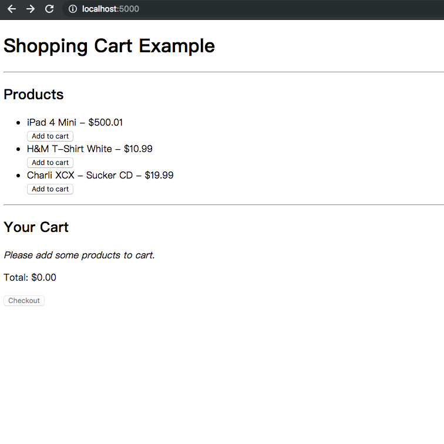

# vuex-rails-shopping-cart
<h3>Description</h3>
  rails architecture - A shopping cart built with Vue 2 and Vuex with webpack 

<h3>Image</h3>
  

      
  

<h3>enviroment</h3>
  rails ~> 5.2.1
  ruby ~> 2.4.0
  vue ^2.5.17
  vuex ^3.0.1

<h3>install</h3> 
  rvm install ruby 2.4.0
  yarn install

<h3>initialize webpacker</h3> 
  $ rails webpacker:install
  $ rails webpacker:install:vue

<h3>execute and run</h3> 
  $ cd vuex-rails-shopping-cart
  $ ./bin/server